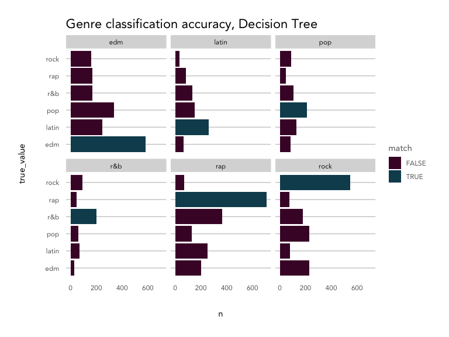
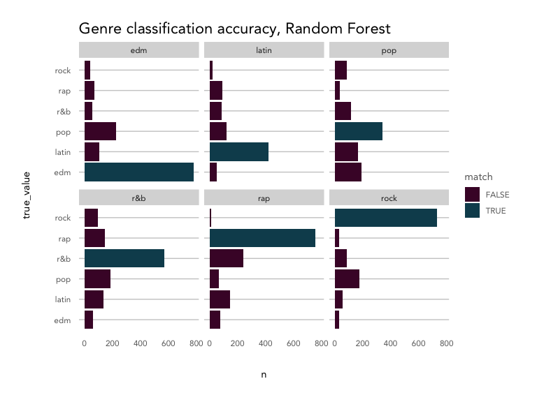
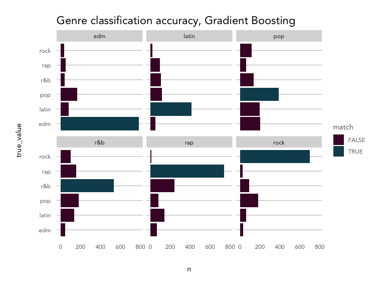

Spotify Audio Features + Music Genres
================

Classifying songs into major music genres Understanding the how
Spotify’s audio features map onto major music genres

## Exploring Spotify’s audio features

Spotify provies 12 [audio
features](https://developer.spotify.com/documentation/web-api/reference/object-model/#audio-features-object)
for each track, including confidence measures like `acousticness`,
`liveness`, `speechiness` and `instrumentalness`, perceptual measures
like `energy`, `loudness`, `danceability` and `valence` (positiveness),
and descriptors like `duration`, `tempo`, `key`, and `mode`.

It’s likely that Spotify uses these features to power their algorithms
for products like Spotify Radio and custom playlists like Discover
Weekly and Daily Mixes. Of course, those algorithms also make use of
Spotify’s vast listener data - your listening and playlist curation
history, as well as the data from users similar to you.

Typically, genre operates in a very subjective zone, where there are no
hard and fast rules for classifying a given track or artist as “hard
rock” vs. “folk rock,” but rather the listener knows it when they hear
it. Spotify has the benefit of letting humans create relationships
between songs and weigh in on genre via listening and creating
playlists. With just the quantitative features, is it possible to
classify songs into broad genres? And what can these audio features tell
us about the qualities of each genre?

We’ll look into a sample of songs from six broad genres - pop, rap,
rock, latin, EDM, and R\&B - to find out.

### Getting the data

Genres were selected from [Every
Noise](http://everynoise.com/everynoise1d.cgi?scope=all), a fascinating
visualization of the Spotify genre-space maintained by a genre
taxonomist. The top four sub-genres for each were used to query Spotify
for 20 playlists each, resulting in about 5000 songs for each genre,
split across a varied sub-genre space.

``` r
library(tidyverse)
library(formattable)
library(randomForest)
library(randomForestExplainer)
library(rpart)
library(rpart.plot)
library(xgboost)
source('../kp_themes/theme_kp.R')
options(scipen = 999)

knitr::opts_chunk$set(echo = TRUE, fig.width = 8, fig.height = 6, warning = FALSE, error = FALSE, message = FALSE)

# refer to spotify_dataset.R for how this dataset was generated
playlist_songs <- read.csv('genre_songs_expanded.csv', stringsAsFactors = FALSE) 

feature_names <- names(playlist_songs)[12:23]
```

### Exploring audio features by genre

``` r
playlist_songs %>%
  select(c('playlist_genre', feature_names)) %>%
  pivot_longer(cols = feature_names) %>%
  ggplot(aes(x = value)) +
  geom_density(aes(color = playlist_genre), alpha = 0.5) +
  facet_wrap(~name, ncol = 3, scales = 'free') +
  labs(title = 'Spotify Audio Feature Density - by Genre',
       x = '', y = 'density') +
  theme_kp() +
  theme(axis.text.y = element_blank()) + 
  scale_color_kp(palette = 'mixed')
```

<!-- -->

Overall, the songs in the dataset tend to have low acousticness,
liveness, instrumentalness and speechiness, with higher danceability,
energy, and loudness. Valence is evenly distributed.

Breaking things out by genre, EDM tracks are least likely to be acoustic
and most likely to have high energy with low valence (sad or depressed);
latin tracks have high valence (are positive or cheerful) and
danceability; rap songs score highly for speechiness and danceability;
and rock songs are most likely to be recorded live and have low
danceability. Pop, latin and EDM songs are more likely to have shorter
durations compared to R\&B, rap, and rock.

Based on the density plot, it looks like energy, valence, tempo and
danceability may provide the most separation between genres during
classification, while instrumentalness and key and key may not help
much.

#### Removing outliers

There are clearly some outliers in `duration` that may skew analysis.
Using the `boxplot` function, we can isolate any values that fall
outside of a given range. The default range is the interquartile range,
or the spread from the 25th to 50th percentile. Because a lot of values
fall outside of that range, we can widen it by incrementing the `range`
parameter. Here we’ve used `range = 4`, which multiplies the
interquartile range by 4 to widen the spread of values we’ll consider
*not* be outliers.

``` r
playlist_songs %>%
  ggplot(aes(y = duration_ms)) +
  geom_boxplot(color = kp_cols('red'), coef = 4) +
  coord_flip() +
  theme_kp() +
  labs(title = 'Duration')
```

<!-- -->

``` r
duration_outliers <- boxplot(playlist_songs$duration_ms, plot = FALSE, range = 4)$out

playlist_songs_no_outliers <- playlist_songs %>%
  filter(!duration_ms %in% duration_outliers) 
```

There were 116 songs that were defined as outliers and removed from the
dataset.

#### Correlation between features

How do these features correlate with one another? Are there any that may
be redundant?

``` r
playlist_songs_no_outliers %>%
  select(feature_names) %>%
  scale() %>%
  cor() %>%
  corrplot::corrplot(method = 'color', 
                     order = 'hclust', 
                     type = 'upper', 
                     diag = FALSE, 
                     tl.col = 'black',
                     addCoef.col = "grey30",
                     number.cex = 0.6,
                     col = colorRampPalette(colors = c(kp_cols('red'), 'white', kp_cols('dark_blue')))(200),
                     main = 'Audio Feature Correlation',
                     mar = c(2,2,2,2),
                     family = 'Avenir')
```

<!-- -->

Across all songs and genres in the dataset, energy and loudness are
fairly highly correlated (0.68). Let’s remove loudness, since energy
appears to give more distinction between genre groups (as seen in the
density plot).

Energy and acousticness are negatively correlated, which makes sense,
along with the positive correlation between danceability and valence
(happier songs lead to more dancing). Liveness, tempo, and energy are
clustered together, as are speechiness and danceability. Interestingly,
danceability is negatively correlated with tempo and energy.

``` r
# remove loudness
feature_names_reduced <- names(playlist_songs)[c(12:14,16:23)]
```

#### Correlation between genres

How do the genres correlate with each other? How consistent are songs
within a given genre?

We’ll take a sample of the dataset and calculate the correlation between
all the songs, then aggregate those measures by genre to produce a
feature that’s basically the average correlation between songs in two
given genres.

``` r
# take a random sample
set.seed(0012)
song_sample <- sample(1:nrow(playlist_songs_no_outliers), nrow(playlist_songs_no_outliers)*.05, replace = FALSE)

# create a key dataframe with ids/genres with numerical index
key <- playlist_songs_no_outliers %>%
  select(track.id, playlist_genre) %>%
  mutate(position = as.character(1:n()))

key <- key[song_sample, ]

# create a correlation matrix, then melt it
song_cor <- playlist_songs_no_outliers[song_sample, ] %>% 
  select(feature_names_reduced) %>%
  scale() %>%
  t() %>%
  cor() %>%
  as.data.frame() %>%
  mutate(index = row.names(.)) %>%
  pivot_longer(-index) %>%
  filter(!is.na(value) & index != name) %>%
  left_join(key, by = c('index' = 'position')) %>%
  left_join(key, by = c('name' = 'position')) 

# summarise by genres
genre_cor <- song_cor %>%
  group_by(playlist_genre.x, playlist_genre.y) %>%
  summarise(avg_cor = mean(value)) %>%
  ungroup() 

genre_cor_matrix <- genre_cor %>%
  pivot_wider(id_cols = 'playlist_genre.x', 
              names_from = 'playlist_genre.y', 
              values_from = 'avg_cor')

row.names(genre_cor_matrix) <- genre_cor_matrix$playlist_genre.x

genre_cor_matrix %>%
  select(-playlist_genre.x) %>%
  as.matrix() %>%
  corrplot::corrplot(method = 'color', 
                     order = 'hclust',
                     type = 'upper',
                     tl.col = 'black',
                     addCoef.col = "grey40",
                     number.cex = 0.75,
                     col = colorRampPalette(colors = c(kp_cols('red'), 'white', kp_cols('dark_blue')))(200),
                     mar = c(2,2,2,2),
                     main = '\nAverage Correlation Between Genre Songs',
                     family = 'Avenir'
                     )
```

<!-- -->

Songs within each genre vary quite a bit\! Rock songs are the most
consistent, with a correlation strength of 0.12, while pop songs are the
least consistent at just 0.02.

Rap and rock (-0.09) and R\&B and EDM (-0.07) have the strongest
negative correlations of any genre pairs.The rest of the genres don’t
negatively or positively correlate much with one another, which may make
them hard to classify.

#### Principal component analysis of features

One way to reduce dimensionality and understand the relationship between
features is to compute their principal components. [Principal Component
Analysis (PCA)](https://uc-r.github.io/pca) reduces the number of
variables in a dataset by finding combinations of those variables,
called principal components, that explain the majority of the
variability in the dataset.

First, we’ll find the covariance between the features, and then their
eigenvalues and eigenvectors. The eigenvalues tell us what percentage of
the variability the principal component (PC) explains, and the
eigenvector describes how the PC summarises the features. We don’t need
to use all the PCs (n-1, so 11 in this case), but generally can simplify
by choosing the number of PCs that together explain the majority of the
variance (75-90%).

``` r
playlist_songs_scaled <- playlist_songs_no_outliers %>%
  mutate_if(is.numeric, scale)

song_cov <- cov(playlist_songs_scaled[,feature_names_reduced])
song_eigen <- eigen(song_cov)

data.frame(proporation_of_variance = song_eigen$values/sum(song_eigen$values)) %>%
  mutate(cumulative_prop = cumsum(proporation_of_variance),
         pc = 1:n()) %>%
  ggplot(aes(x = pc, y = cumulative_prop)) + 
  geom_point() + 
  geom_line() +
  ylim(c(0,1)) +
  labs(title = 'Cumulative Scree Plot', 
       x = 'Principal Component', y = 'Cumulative % of variance explained') +
  theme_kp() 
```

<!-- -->

We would need to retain 7 PCs to explain \>75% of the variance, which is
a great improvement from 12 features, but doesn’t help much with
understanding the relationship between the features and song genres.

Let’s look a litle closer at the first two for simplicity’s sake.

``` r
song_eigenvectors <- song_eigen$vectors[,1:2] * -1
song_eigenvectors <- song_eigenvectors %>%
  as.data.frame() %>%
  mutate(feature = row.names(song_cov)) %>%
  rename('PC1' = 'V1',
         'PC2' = 'V2')

song_eigenvectors %>%
  pivot_longer(cols = c('PC1', 'PC2')) %>%
  ggplot(aes(x = feature, y = value)) + 
  geom_col(aes(fill = feature), position = 'dodge') +
  facet_wrap(~name, ncol = 2) +
  coord_flip() +
  theme_kp() + 
  scale_fill_kp() +
  labs(title = 'Principal Component Loadings', 
       x = 'loading', y = '')
```

<!-- -->

The first PC is characterized by high acoustincess and low tempo and
energy; the second by low valence and danceability. Songs with similar
scores will map onto these components.

How does this map onto genres?

``` r
PC <- data.frame(playlist_genre = playlist_songs_scaled$playlist_genre,
                 PC1 = as.matrix(playlist_songs_scaled[,feature_names_reduced]) %*% song_eigenvectors[,1], 
                 PC2 = as.matrix(playlist_songs_scaled[,feature_names_reduced]) %*% song_eigenvectors[,2])

PC %>% 
  ggplot(aes(x = PC1, y = PC2, color = playlist_genre)) + 
  geom_point(alpha = 0.25) + 
  facet_wrap(~playlist_genre) +
  labs(title =paste('Plotting principal components 1 vs 2')) +
  theme_kp() + 
  scale_color_kp(palette = 'mixed') 
```

<!-- -->

It’s clear once we plot the first two components against each other why
they don’t explain all of the variability - the distributions of each
genre look fairly similar to each other (i.e. the PCs are not clearly
dividing them from each other). Pop and rock tend to push into the upper
right quadrant, mapping slightly more strongly onto PC1 than the other
genres, while EDM pushes into the top left quadrant, mapping more
strongly onto PC2 than other genres, likely due to its
characteristically low valence.

## Classifying songs into genres using audio features

Our first question was *is it possible* to classify songs into genres
with just audio features; our secondary question is *what can these
audio features tell us* about the distinctions between genre. With that
aim, we should focus on classification models that are interpretable and
provide insight into which features were important in organizing a new
song into a given genre.

Classification algorithms that allow for greater interpretation of the
features include `decision trees`, `random forests`, and `gradient
boosting`.

### Preparing the data for training

First, we’ll scale the numeric features, and then split into a training
set (80% of the songs) and a test set (20%).

``` r
set.seed(1234)
training_songs <- sample(1:nrow(playlist_songs_scaled), nrow(playlist_songs_scaled)*.80, replace = FALSE)
train_set <- playlist_songs_scaled[training_songs, c('playlist_genre', feature_names_reduced)] 
test_set <- playlist_songs_scaled[-training_songs, c('playlist_genre', feature_names_reduced)] 

train_resp <- playlist_songs_scaled[training_songs, 'playlist_genre']
test_resp <- playlist_songs_scaled[-training_songs, 'playlist_genre']
```

``` r
classification_plot <- function(compare_df, model_name){
  
  compare_df %>%
    count(true_value, predicted_value) %>%
    mutate(match = ifelse(true_value == predicted_value, TRUE, FALSE)) %>%
    ggplot(aes(x = true_value, y = n)) +
    geom_col(aes(fill = match), position = 'dodge') +
    facet_wrap(~predicted_value, ncol = 3) +
    coord_flip() + 
    labs(title = paste0('Genre classification accuracy, ', model_name)) +
    theme_kp() +
    scale_fill_kp()
  
  
}
```

### Decision Tree

[Decision
trees](https://medium.com/analytics-vidhya/a-guide-to-machine-learning-in-r-for-beginners-decision-trees-c24dfd490abb)
are a simple classification tool that have an output that reads like a
flow chart, where each node represents an feature, each branch an
outcome of a decision on that feature, and the leaves represent the
class of the final decision. The algorithm works by partitioning the
data into sub-spaces repeatedly in order to create the most homogeneous
groups possible. The rules generated by the algorithm are visualized in
the tree.

The biggest benefit of decision trees is in interpretability - the
resulting tree provides a lot of information about feature importance.
They are also non-parametric and make no assumptions about the data. On
the flip side, they are prone to overfitting and may produce high
variance between models created from different samples of the same data.

``` r
model_dt <- rpart(playlist_genre ~ ., data = train_set)

rpart.plot(model_dt, 
           type = 5, 
           extra = 104,
           box.palette = list(purple = "#490B32",
               red = "#9A031E",
               orange = '#FB8B24',
               dark_blue = "#0F4C5C",
               blue = "#5DA9E9",
               grey = '#66717E'),
           leaf.round = 0,
           fallen.leaves = FALSE, 
           branch = 0.3, 
           under = TRUE,
           under.col = 'grey40',
           family = 'Avenir',
           main = 'Genre Decision Tree',
           tweak = 1.2)
```

<!-- -->

The most important feature in the decision tree model is speechiness,
separating `rap` from the rest of the classes on the first decision.
Next, tracks with low danceability are classified as `rock`; then,
high-tempo tracks are labelled as `EDM`; next, longer songs are
considered `R&B`, and then finally, songs with high danceability are
grouped into the `latin` genre, and everything else is considered `pop.`

The values under the leaves represent the distribution of true values
for each class grouped into that leaf; for example, in the `rap`
predicted class, 12% were `EDM`, 15% were `latin`, 8% were `pop`, 20%
were `R&B`, 41% matched the true value, `rap`, and 3% were `rock`
tracks. The value beneath that indicates the percentage of observations
classified into that leaf, so 24% of all tracks were classified as `rap`
in this tree.

The decision tree classifier was best at classifying `rap` (41% correct)
and `rock` (43% correct) and had the most trouble getting it right for
`pop` tracks (30% correct) in the training data. How does it perform on
the hold-out test data? The plot below shows the predicted value versus
the true value for each class.

``` r
predict_dt <- predict(object = model_dt, newdata = test_set)
max_id <- apply(predict_dt, 1, which.max)
pred <- levels(as.factor(test_set$playlist_genre))[max_id]

compare_dt <- data.frame(true_value = test_set$playlist_genre,
                         predicted_value = pred,
                         model = 'decision_tree',
                         stringsAsFactors = FALSE)

# visualize
classification_plot(compare_dt, 'Decision Tree')
```

<!-- -->

The results are similar in the test data. The tree struggled to
distinguish between `pop`, `latin` and `R&B`, which all shared a branch.

### Random Forest

[Random
forests](https://towardsdatascience.com/random-forest-in-r-f66adf80ec9)
are an ensemble of decision trees, aggregating classifications made by
multiple decision trees of different depths. This is also known as
bootsrap aggregating (or bagging), and helps avoid overfitting and
improves prediction accuracy.

We’ll run a random forest model with 100 trees to start, and then take a
look at the variable
importance.

``` r
model_rf <- randomForest(as.factor(playlist_genre) ~ ., ntree = 100, importance = TRUE, data = train_set)

importance(model_rf, type = 2) %>%
  as.data.frame() %>%
  mutate(measure = row.names(.)) %>%
  ggplot(aes(x = reorder(measure, MeanDecreaseGini), y = MeanDecreaseGini)) +
  geom_point(color = kp_cols('purple'), size = 2) +
  coord_flip() +
  theme_kp() +
  labs(title = 'Variable Importance, Random Forest',
       y = 'Mean decrease in node impurity', x = '')
```

<!-- -->

Variable importance here is ranked by the mean decrease in node impurity
resulting from a split on that feature. For example, on average, a split
on tempo resulted in the biggest decreases in node impurity, or rather,
the greatest jumps in node purity. Since the first node generally
creates the biggest reduction in impurity, this also indicates that
tempo was the most common root node in the 100 decision trees in the
model.

Speechiness and danceability were also important features, as we saw in
the decision tree model. Mode, key, liveness and instrumentalness
contributed the least to reducing node impurity and were probably not
found on most trees.

Has predictive power increased from the single decision tree?

``` r
predict_rf <- predict(model_rf, test_set)

compare_rf <- data.frame(true_value = test_resp,
                         predicted_value = predict_rf,
                         model = 'random_forest',
                         stringsAsFactors = FALSE) 

# visualize
classification_plot(compare_rf, 'Random Forest')
```

<!-- -->

The random forest model improved from the single decision tree in
predicting all classes but `pop`\!

### Gradient Boosting with XGBoost

The next round of improvements to the random forest model come from
boosting, or building models sequentially, minimizing errors and
boosting the influence of the most successful models. Adding in the
gradient descent algorithm for minimizing errors results in a gradient
boosting model. Here, we’ll use
[XGBoost](https://towardsdatascience.com/https-medium-com-vishalmorde-xgboost-algorithm-long-she-may-rein-edd9f99be63d),
which provies parallel processing to decrease compute time as well as
various other improvements.

We’ll use the `xgboost` function with most of the default hyperparameter
settings, just setting `objective` to handle multiclass
classification.

``` r
matrix_train_gb <- xgb.DMatrix(data = as.matrix(train_set[,-1]), label = as.integer(as.factor(train_set[,1])))
matrix_test_gb <- xgb.DMatrix(data = as.matrix(test_set[,-1]), label = as.integer(as.factor(test_set[,1])))

model_gb <- xgboost(data = matrix_train_gb, 
                    nrounds = 50,
                    verbose = FALSE,
                    params = list(objective = "multi:softmax",
                                  num_class = 6 + 1))

xgb.importance(model = model_gb) %>%
  ggplot(aes(x = reorder(Feature, Gain), y = Gain)) +
  geom_point(color = kp_cols('purple'), size = 2) +
  coord_flip() +
  theme_kp() +
  labs(title = 'Variable Importance, XGBoost',
       y = 'Gain', x = '')
```

<!-- -->

Variables are ranked by gain to denote importance to the XGBoost model,
where gain refers to the improvement in accuracy contributed by the
feature. Again, tempo is the most important variable, followed by
speechiness, danceability, energy and valence, while key and mode fall
to the bottom.

Does gradient boosting provide significant increases to accuracy versus
the random forest model?

``` r
predict_gb <- predict(model_gb, matrix_test_gb)
predict_gb <- levels(as.factor(test_set$playlist_genre))[predict_gb]

compare_gb <- data.frame(true_value = test_resp,
                         predicted_value = predict_gb,
                         model = 'xgboost',
                         stringsAsFactors = FALSE) 

# visualize
classification_plot(compare_gb, 'Gradient Boosting')
```

<!-- -->

The classification plot looks nearly identical to the random forest
classification plot, with slight improvements to the `edm` class.

### Model Comparison

``` r
classification_test_results <- compare_rf %>%
  rbind(compare_dt) %>%
  rbind(compare_gb)

accuracy_results <- classification_test_results %>%
  mutate(match = ifelse(true_value == predicted_value, 1, 0)) %>%
  group_by(model) %>%
  summarise(accurate = sum(match),
            total = n()) %>%
  ungroup() %>%
  mutate(accuracy = accurate/total)

accuracy_results %>%
  mutate(accuracy = formattable::percent(accuracy,2)) %>%
  select(model, accuracy) %>%
  arrange(desc(accuracy)) %>%
  knitr::kable()
```

| model          | accuracy |
| :------------- | -------: |
| random\_forest |   54.39% |
| xgboost        |   53.79% |
| decision\_tree |   37.86% |

How did each model fare for each genre?

``` r
classification_test_results %>%
  count(true_value, predicted_value, model) %>%
  mutate(match = ifelse(true_value == predicted_value, TRUE, FALSE)) %>%
  group_by(true_value, model, match) %>%
  summarise(n = sum(n)) %>%
  group_by(true_value, model) %>%
  mutate(pct = n/sum(n)) %>%
  ungroup() %>%
  filter(match == TRUE) %>%
  ggplot(aes(x = true_value, y = pct, fill = match)) +
  geom_col(aes(fill = match), position = 'dodge') +
  facet_wrap( ~ model, ncol = 3) +
  coord_flip() + 
  labs(title = 'Genre Accuracy by Model',
       y = 'Percent accurately classified') +
  theme_kp() +
  scale_fill_kp()
```

<!-- -->

All genres showed gains in accuracy as we moved from simpler to more
complex (decision tree –\> XGBoost). `Pop`, `latin`, and `R&B` remained
the most difficult to classify, while `EDM` and `rock` reached more than
65% accuracy.

``` r
importance_dt <- data.frame(importance = model_dt$variable.importance)
importance_dt$feature <- row.names(importance_dt)

importance_rf <- data.frame(importance = importance(model_rf, type = 2))
importance_rf$feature <- row.names(importance_rf)

importance_gb <- xgb.importance(model = model_gb)

compare_importance <- importance_gb %>%
  select(Feature, Gain) %>%
  left_join(importance_dt, by = c('Feature' = 'feature')) %>%
  left_join(importance_rf, by = c('Feature' = 'feature')) %>%
  rename('xgboost_imp' = 'Gain',
         'decision_tree_imp' = 'importance',
         'random_forest_imp' = 'MeanDecreaseGini')
```

### Appendix

``` r
# run k nearest neighbors 
# at various values of k
# select_k <- NULL
# 
# for(i in 1:50){
#   result_knn <- class::knn(train = train_set[,-1], test = test_set[,-1], cl = train_resp, k = i)
# 
#   compare_knn <- data.frame(true_value = test_resp,
#                                 predicted_value = result_knn,
#                                 stringsAsFactors = FALSE) %>%
#     count(true_value, predicted_value) %>%
#     mutate(match = ifelse(true_value == predicted_value, TRUE, FALSE))
#   
#   accuracy_knn <- compare_knn %>%
#     group_by(match) %>%
#     summarise(n = sum(n)) %>%
#     ungroup() %>%
#     mutate(percent = n/sum(n),
#            k = i,
#            model = 'knn') %>%
#     filter(match == TRUE)
#     
#   select_k <- rbind(select_k, accuracy_knn)
#   
# }
# 
# select_k %>%
#   ggplot(aes(x = k, y = percent)) + 
#   geom_point() + 
#   geom_line() +
#   theme_kp() +
#   labs(title = 'Accuracy by Number of Neighbors',
#        x = 'Number of Neighbors (k)',
#        y = 'Percent of observations accurately classified')
# 
# # 29 is the best
# result_knn <- class::knn(train = train_set[,-1], test = test_set[,-1], cl = train_resp, k = 29)
# 
# # check
# compare_knn <- data.frame(true_value = test_resp,
#                           predicted_value = result_knn,
#                           model = 'knn',
#                           stringsAsFactors = FALSE)
# 
# # visualize
# classification_plot(compare_knn, 'KNN')
```
