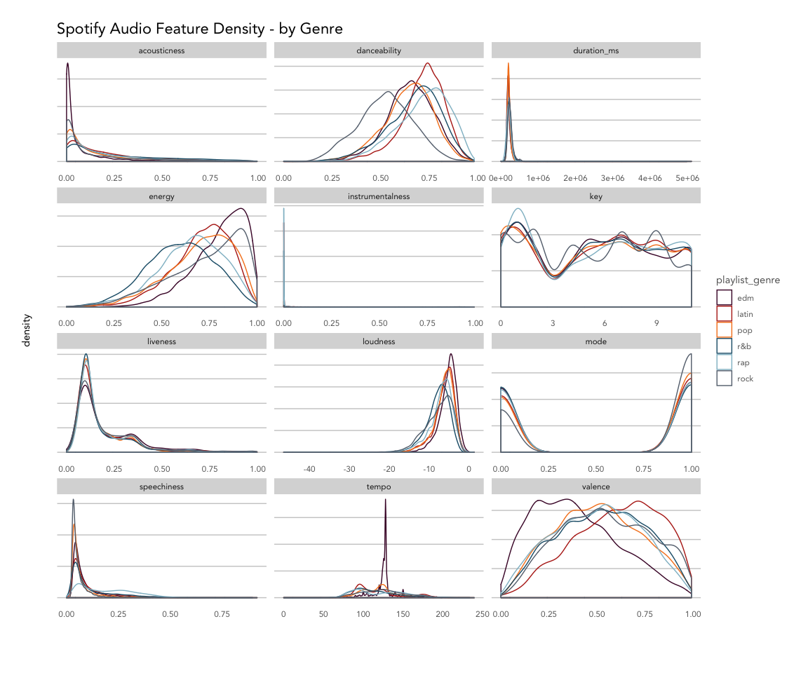
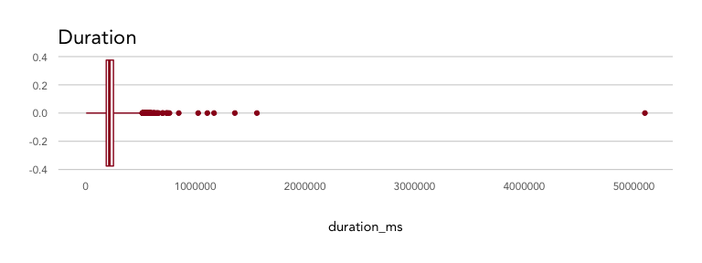
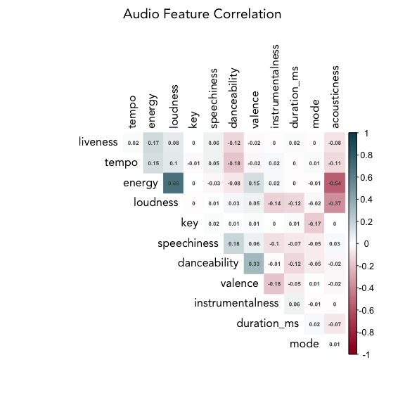
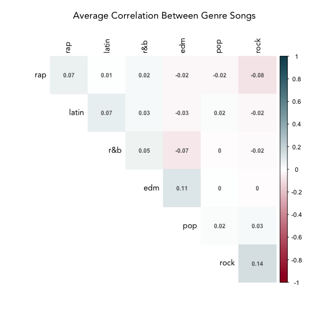
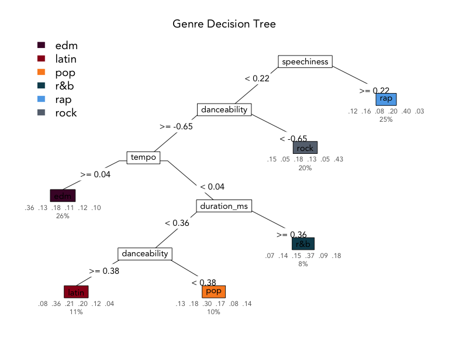
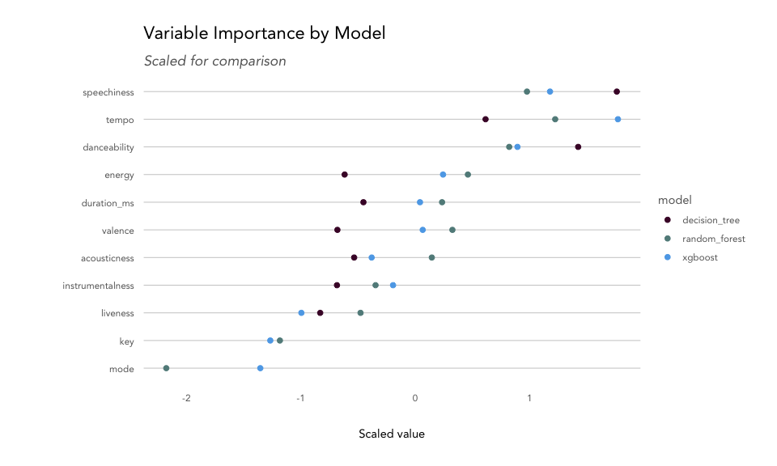
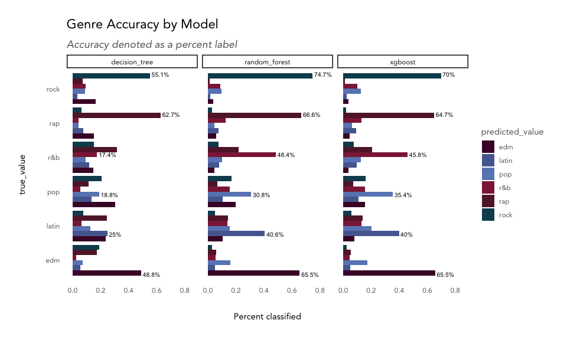
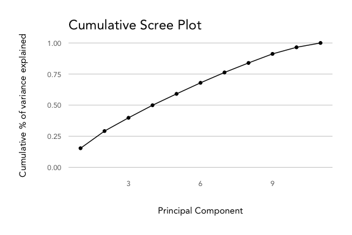
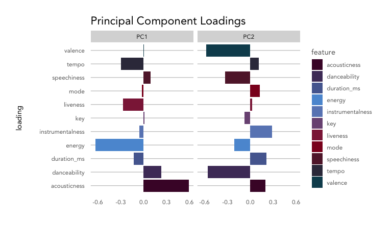
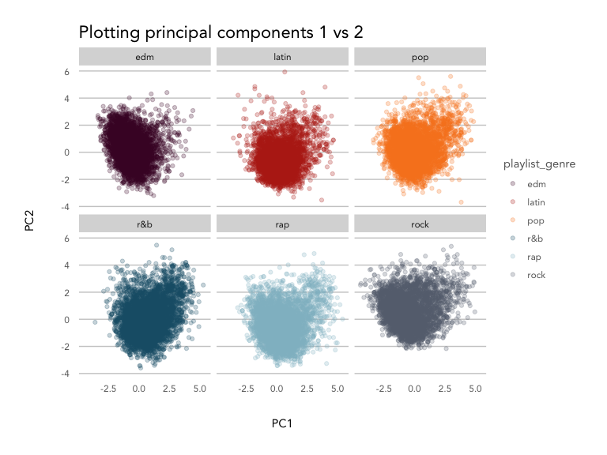

Spotify Audio Features + Music Genres
================

## Exploring Spotify’s audio features

The [Spotify Web
API](https://developer.spotify.com/documentation/web-api/) provides
artist, album, and track data, as well as audio features and analysis,
all easily accessible via the R package
[`spotifyr`](https://github.com/charlie86/spotifyr).

There are 12 [audio
features](https://developer.spotify.com/documentation/web-api/reference/object-model/#audio-features-object)
for each track, including confidence measures like `acousticness`,
`liveness`, `speechiness` and `instrumentalness`, perceptual measures
like `energy`, `loudness`, `danceability` and `valence` (positiveness),
and descriptors like `duration`, `tempo`, `key`, and `mode`.

It’s likely that Spotify uses these features to power products like
Spotify Radio and custom playlists like Discover Weekly and Daily Mixes.
Of course, those products definitely also make use of Spotify’s vast
listener data like listening history and playlist curation, for you and
users similar to you.

Musical genre is far from black and white - there are no hard and fast
rules for classifying a given track or artist as “hard rock” vs. “folk
rock,” but rather the listener knows it when they hear it. Spotify has
the benefit of letting humans create relationships between songs and
weigh in on genre via listening and creating playlists. With just the
quantitative features, is it possible to classify songs into broad
genres? And what can these audio features tell us about the qualities of
each genre?

We’ll look into a sample of songs from six broad genres - `pop`, `rap`,
`rock`, `latin`, `EDM`, and `R&B` - to find out.

### TL;DR:

`Rap`: speechy.  
`Rock`: can’t dance to it.  
`EDM`: high tempo.  
`R&B`: long songs.  
`Latin`: very danceable.  
`Pop`: everything else.

### Table of Contents

  - Getting the data  
  - Exploring audio features by genre
      - Removing outliers  
      - Correlation between features  
      - Correlation within genres  
  - Classifying songs into genres using audio features
      - Preparing the data for training  
      - Modeling
          - Decision tree  
          - Random forest  
          - Gradient boosting with XGBoost  
      - Model comparison
          - Variable importance  
          - Accuracy comparison  
  - Bonus: Principal component analysis of features

### Getting the data

Genres were selected from [Every
Noise](http://everynoise.com/everynoise1d.cgi?scope=all), a fascinating
visualization of the Spotify genre-space maintained by a genre
taxonomist. The top four sub-genres for each were used to query Spotify
for 20 playlists each, resulting in about 5000 songs for each genre,
split across a varied sub-genre space.

``` r
library(tidyverse)
library(formattable)
library(randomForest)
library(rpart)
library(rpart.plot)
library(xgboost)
source('../kp_themes/theme_kp.R')
options(scipen = 999)

knitr::opts_chunk$set(echo = TRUE, fig.width = 8, fig.height = 6, 
                      warning = FALSE, error = FALSE, message = FALSE)

# refer to spotify_dataset.R for how this dataset was generated
playlist_songs <- read.csv('genre_songs_expanded.csv', stringsAsFactors = FALSE) 

feature_names <- names(playlist_songs)[12:23]

glimpse(playlist_songs,width = 60)
```

    ## Observations: 33,179
    ## Variables: 23
    ## $ track.id                 <chr> "6f807x0ima9a1j3VPbc7VN"…
    ## $ track.name               <chr> "I Don't Care (with Just…
    ## $ track.artist             <chr> "Ed Sheeran", "Zara Lars…
    ## $ track.popularity         <int> 68, 72, 69, 74, 70, 69, …
    ## $ track.album.id           <chr> "2oCs0DGTsRO98Gh5ZSl2Cx"…
    ## $ track.album.name         <chr> "I Don't Care (with Just…
    ## $ track.album.release_date <chr> "2019-06-14", "2019-07-0…
    ## $ playlist_name            <chr> "Pop Remix", "Pop Remix"…
    ## $ playlist_id              <chr> "37i9dQZF1DXcZDD7cfEKhW"…
    ## $ playlist_genre           <chr> "pop", "pop", "pop", "po…
    ## $ playlist_subgenre        <chr> "dance pop", "dance pop"…
    ## $ danceability             <dbl> 0.748, 0.675, 0.493, 0.5…
    ## $ energy                   <dbl> 0.916, 0.931, 0.773, 0.7…
    ## $ key                      <int> 6, 1, 5, 5, 2, 8, 7, 1, …
    ## $ loudness                 <dbl> -2.634, -3.432, -3.791, …
    ## $ mode                     <int> 1, 0, 0, 1, 1, 1, 1, 0, …
    ## $ speechiness              <dbl> 0.0583, 0.0742, 0.1570, …
    ## $ acousticness             <dbl> 0.10200, 0.07940, 0.4290…
    ## $ instrumentalness         <dbl> 0.00000000, 0.00002330, …
    ## $ liveness                 <dbl> 0.0653, 0.1100, 0.0807, …
    ## $ valence                  <dbl> 0.518, 0.613, 0.301, 0.7…
    ## $ tempo                    <dbl> 122.036, 124.008, 123.14…
    ## $ duration_ms              <int> 194754, 176616, 193548, …

``` r
playlist_songs %>% 
  count(playlist_genre) %>%
  knitr::kable()
```

| playlist\_genre |    n |
| :-------------- | ---: |
| edm             | 6028 |
| latin           | 5035 |
| pop             | 5612 |
| r\&b            | 5761 |
| rap             | 5645 |
| rock            | 5098 |

### Exploring audio features by genre

``` r
playlist_songs %>%
  select(c('playlist_genre', feature_names)) %>%
  pivot_longer(cols = feature_names) %>%
  ggplot(aes(x = value)) +
  geom_density(aes(color = playlist_genre), alpha = 0.5) +
  facet_wrap(~name, ncol = 3, scales = 'free') +
  labs(title = 'Spotify Audio Feature Density - by Genre',
       x = '', y = 'density') +
  theme_kp() +
  theme(axis.text.y = element_blank()) + 
  scale_color_kp(palette = 'mixed')
```

<!-- -->

Overall, the songs in the dataset tend to have low acousticness,
liveness, instrumentalness and speechiness, with higher danceability,
energy, and loudness. Valence varies across genres.

Breaking things out by genre, `EDM` tracks are least likely to be
acoustic and most likely to have high energy with low valence (sad or
depressed); `latin` tracks have high valence (are positive or cheerful)
and danceability; `rap` songs score highly for speechiness and
danceability; and `rock` songs are most likely to be recorded live and
have low danceability. `Pop`, `latin` and `EDM` songs are more likely to
have shorter durations compared to `R&B`, `rap`, and `rock.`

Based on the density plot, it looks like energy, valence, tempo and
danceability may provide the most separation between genres during
classification, while instrumentalness and key and key may not help
much.

#### Removing outliers

There are clearly some outliers in `duration` that may skew analysis.
Using the `boxplot` function, we can isolate any values that fall
outside of a given range. The default range is the interquartile range,
or the spread from the 25th to 50th percentile. Because a lot of values
fall outside of that range, we can widen it by incrementing the `range`
parameter. Here we’ve used `range = 4`, which multiplies the
interquartile range by 4 to widen the spread of values we’ll consider
*not* be outliers.

``` r
playlist_songs %>%
  ggplot(aes(y = duration_ms)) +
  geom_boxplot(color = kp_cols('red'), coef = 4) +
  coord_flip() +
  labs(title = 'Duration') +
  theme_kp() 
```

<!-- -->

``` r
duration_outliers <- boxplot(playlist_songs$duration_ms, 
                             plot = FALSE, range = 4)$out

playlist_songs_no_outliers <- playlist_songs %>%
  filter(!duration_ms %in% duration_outliers) 
```

There were 116 songs that were defined as outliers and removed from the
dataset.

#### Correlation between features

How do these features correlate with one another? Are there any that may
be redundant?

``` r
playlist_songs_no_outliers %>%
  select(feature_names) %>%
  scale() %>%
  cor() %>%
  corrplot::corrplot(method = 'color', 
                     order = 'hclust', 
                     type = 'upper', 
                     diag = FALSE, 
                     tl.col = 'black',
                     addCoef.col = "grey30",
                     number.cex = 0.6,
                     col = colorRampPalette(colors = c(
                       kp_cols('red'), 
                       'white', 
                       kp_cols('dark_blue')))(200),
                     main = 'Audio Feature Correlation',
                     mar = c(2,2,2,2),
                     family = 'Avenir')
```

<!-- -->

Across all songs and genres in the dataset, energy and loudness are
fairly highly correlated (0.68). Let’s remove loudness, since energy
appears to give more distinction between genre groups (as seen in the
density plot).

Energy and acousticness are negatively correlated, which makes sense,
along with the positive correlation between danceability and valence
(happier songs lead to more dancing). Liveness, tempo, and energy are
clustered together, as are speechiness and danceability. Interestingly,
danceability is negatively correlated with tempo and energy.

``` r
# remove loudness
feature_names_reduced <- names(playlist_songs)[c(12:14,16:23)]
```

#### Correlation within genres

How do the genres correlate with each other? How consistent are songs
within a given genre?

We’ll take a sample of the dataset and calculate the correlation between
all the songs, then aggregate those measures by genre to produce a
feature that’s basically the average correlation between songs in two
given genres.

``` r
# take a random sample
set.seed(0012)
song_sample <- sample(1:nrow(playlist_songs_no_outliers), nrow(playlist_songs_no_outliers)*.05, replace = FALSE)

# create a key dataframe with ids/genres with numerical index
key <- playlist_songs_no_outliers %>%
  select(track.id, playlist_genre) %>%
  mutate(position = as.character(1:n()))

key <- key[song_sample, ]

# create a correlation matrix, then melt it
song_cor <- playlist_songs_no_outliers[song_sample, ] %>% 
  select(feature_names_reduced) %>%
  scale() %>%
  t() %>%
  cor() %>%
  as.data.frame() %>%
  mutate(index = row.names(.)) %>%
  pivot_longer(-index) %>%
  filter(!is.na(value) & index != name) %>%
  left_join(key, by = c('index' = 'position')) %>%
  left_join(key, by = c('name' = 'position')) 

# summarise by genres
genre_cor <- song_cor %>%
  group_by(playlist_genre.x, playlist_genre.y) %>%
  summarise(avg_cor = mean(value)) %>%
  ungroup() 

genre_cor_matrix <- genre_cor %>%
  pivot_wider(id_cols = 'playlist_genre.x', 
              names_from = 'playlist_genre.y', 
              values_from = 'avg_cor')

row.names(genre_cor_matrix) <- genre_cor_matrix$playlist_genre.x

genre_cor_matrix %>%
  select(-playlist_genre.x) %>%
  as.matrix() %>%
  corrplot::corrplot(method = 'color', 
                     order = 'hclust',
                     type = 'upper',
                     tl.col = 'black',
                     addCoef.col = "grey40",
                     number.cex = 0.75,
                     col = colorRampPalette(colors = c(
                       kp_cols('red'), 
                       'white', 
                       kp_cols('dark_blue')))(200),
                     mar = c(2,2,2,2),
                     main = '\nAverage Correlation Between Genre Songs',
                     family = 'Avenir'
                     )
```

<!-- -->

Songs within each genre vary quite a bit\! Rock songs are the most
consistent, with a correlation strength of 0.12, while pop songs are the
least consistent at just 0.02.

Rap and rock (-0.09) and R\&B and EDM (-0.07) have the strongest
negative correlations of any genre pairs.The rest of the genres don’t
negatively or positively correlate much with one another, which may make
them hard to classify.

## Classifying songs into genres using audio features

Our first question was *is it possible* to classify songs into genres
with just audio features; our secondary question is *what can these
audio features tell us* about the distinctions between genre. With that
aim, we should focus on classification models that are interpretable and
provide insight into which features were important in organizing a new
song into a given genre.

Classification algorithms that allow for greater interpretation of the
features include `decision trees`, `random forests`, and `gradient
boosting`.

### Preparing the data for training

First, we’ll scale the numeric features, and then split into a training
set (80% of the songs) and a test set (20%).

``` r
playlist_songs_scaled <- playlist_songs_no_outliers %>%
  mutate_if(is.numeric, scale)

set.seed(1234)
training_songs <- sample(1:nrow(playlist_songs_scaled), nrow(playlist_songs_scaled)*.80, replace = FALSE)
train_set <- playlist_songs_scaled[training_songs, c('playlist_genre', feature_names_reduced)] 
test_set <- playlist_songs_scaled[-training_songs, c('playlist_genre', feature_names_reduced)] 

train_resp <- playlist_songs_scaled[training_songs, 'playlist_genre']
test_resp <- playlist_songs_scaled[-training_songs, 'playlist_genre']
```

### Modeling

#### Decision tree

[Decision
trees](https://medium.com/analytics-vidhya/a-guide-to-machine-learning-in-r-for-beginners-decision-trees-c24dfd490abb)
are a simple classification tool that have an output that reads like a
flow chart, where each node represents an feature, each branch an
outcome of a decision on that feature, and the leaves represent the
class of the final decision. The algorithm works by partitioning the
data into sub-spaces repeatedly in order to create the most homogeneous
groups possible. The rules generated by the algorithm are visualized in
the tree.

The biggest benefit of decision trees is in interpretability - the
resulting tree provides a lot of information about feature importance.
They are also non-parametric and make no assumptions about the data. On
the flip side, they are prone to overfitting and may produce high
variance between models created from different samples of the same data.

``` r
model_dt <- rpart(playlist_genre ~ ., data = train_set)

rpart.plot(model_dt, 
           type = 5, 
           extra = 104,
           box.palette = list(purple = "#490B32",
               red = "#9A031E",
               orange = '#FB8B24',
               dark_blue = "#0F4C5C",
               blue = "#5DA9E9",
               grey = '#66717E'),
           leaf.round = 0,
           fallen.leaves = FALSE, 
           branch = 0.3, 
           under = TRUE,
           under.col = 'grey40',
           family = 'Avenir',
           main = 'Genre Decision Tree',
           tweak = 1.2)
```

<!-- -->

The most important feature in the decision tree model is speechiness,
separating `rap` from the rest of the classes on the first decision.
Next, tracks with low danceability are classified as `rock`; then,
high-tempo tracks are labelled as `EDM`; next, longer songs are
considered `R&B`, and then finally, songs with high danceability are
grouped into the `latin` genre, and everything else is considered `pop.`

The values under the leaves represent the distribution of true values
for each class grouped into that leaf; for example, in the `rap`
predicted class, 12% were `EDM`, 15% were `latin`, 8% were `pop`, 20%
were `R&B`, 41% matched the true value, `rap`, and 3% were `rock`
tracks. The value beneath that indicates the percentage of observations
classified into that leaf, so 24% of all tracks were classified as `rap`
in this tree.

The decision tree classifier was best at classifying `rap` (41% correct)
and `rock` (43% correct) and had the most trouble getting it right for
`pop` tracks (30% correct) in the training data. How does it perform on
the hold-out test data? The plot below shows the predicted value versus
the true value for each class.

``` r
predict_dt <- predict(object = model_dt, newdata = test_set)
max_id <- apply(predict_dt, 1, which.max)
pred <- levels(as.factor(test_set$playlist_genre))[max_id]

compare_dt <- data.frame(true_value = test_set$playlist_genre,
                         predicted_value = pred,
                         model = 'decision_tree',
                         stringsAsFactors = FALSE)

model_accuracy_calc <- function(df, model_name) {
  df %>% 
    mutate(match = ifelse(true_value == predicted_value, TRUE, FALSE)) %>% 
    count(match) %>% 
    mutate(accuracy = n/sum(n),
           model = model_name)
}

accuracy_dt <- model_accuracy_calc(df = compare_dt, model_name = 'decision_tree')
```

The decision tree model shows an overall accuracy of 37.9%.

#### Random forest

[Random
forests](https://towardsdatascience.com/random-forest-in-r-f66adf80ec9)
are an ensemble of decision trees, aggregating classifications made by
multiple decision trees of different depths. This is also known as
bootsrap aggregating (or bagging), and helps avoid overfitting and
improves prediction accuracy.

We’ll run a random forest model with 100 trees to start, and then take a
look at the variable
importance.

``` r
model_rf <- randomForest(as.factor(playlist_genre) ~ ., ntree = 100, importance = TRUE, data = train_set)

predict_rf <- predict(model_rf, test_set)

compare_rf <- data.frame(true_value = test_resp,
                         predicted_value = predict_rf,
                         model = 'random_forest',
                         stringsAsFactors = FALSE) 

accuracy_rf <- model_accuracy_calc(df = compare_rf, model_name = 'random_forest')
```

The random forest model shows an overall accuracy of 54.4%.

#### Gradient boosting with XGBoost

The next round of improvements to the random forest model come from
boosting, or building models sequentially, minimizing errors and
boosting the influence of the most successful models. Adding in the
gradient descent algorithm for minimizing errors results in a gradient
boosting model. Here, we’ll use
[XGBoost](https://towardsdatascience.com/https-medium-com-vishalmorde-xgboost-algorithm-long-she-may-rein-edd9f99be63d),
which provies parallel processing to decrease compute time as well as
various other improvements.

We’ll use the `xgboost` function with most of the default hyperparameter
settings, just setting `objective` to handle multiclass
classification.

``` r
matrix_train_gb <- xgb.DMatrix(data = as.matrix(train_set[,-1]), label = as.integer(as.factor(train_set[,1])))
matrix_test_gb <- xgb.DMatrix(data = as.matrix(test_set[,-1]), label = as.integer(as.factor(test_set[,1])))

model_gb <- xgboost(data = matrix_train_gb, 
                    nrounds = 50,
                    verbose = FALSE,
                    params = list(objective = "multi:softmax",
                                  num_class = 6 + 1))

predict_gb <- predict(model_gb, matrix_test_gb)
predict_gb <- levels(as.factor(test_set$playlist_genre))[predict_gb]

compare_gb <- data.frame(true_value = test_resp,
                         predicted_value = predict_gb,
                         model = 'xgboost',
                         stringsAsFactors = FALSE) 

accuracy_gb <- model_accuracy_calc(df = compare_gb, model_name = 'xgboost')
```

The gradient boosting model shows an overall accuracy of 53.8%.

### Model comparison

#### Variable importance

``` r
importance_dt <- data.frame(importance = model_dt$variable.importance)
importance_dt$feature <- row.names(importance_dt)

importance_rf <- data.frame(importance = importance(model_rf, type = 2))
importance_rf$feature <- row.names(importance_rf)

importance_gb <- xgb.importance(model = model_gb)

compare_importance <- importance_gb %>%
  select(Feature, Gain) %>%
  left_join(importance_dt, by = c('Feature' = 'feature')) %>%
  left_join(importance_rf, by = c('Feature' = 'feature')) %>%
  rename('xgboost' = 'Gain',
         'decision_tree' = 'importance',
         'random_forest' = 'MeanDecreaseGini') 

compare_importance %>%
  mutate_if(is.numeric, scale, center = TRUE) %>%
  pivot_longer(cols = c('xgboost', 'decision_tree', 'random_forest')) %>%
  rename('model' = 'name') %>%
  ggplot(aes(x = reorder(Feature, value, mean, na.rm = TRUE), y = value, color = model)) + 
  geom_point(size = 2) + 
  coord_flip() +
  labs(title = 'Variable Importance by Model',
       subtitle = 'Scaled for comparison',
       y = 'Scaled value', x = '') +
  theme_kp() + 
  scale_color_kp(palette = 'cool')
```

<!-- -->

Each model uses a different measure for explaining variable importance.
Decision trees provide a score for each feature based on its usefulness
in splitting the data. For a random forest, we can use `mean decrease in
node impurity`, which is the average decrease in node impurity/increase
in node purity resulting from a split on a given feature. For XGBoost,
we can use `gain`, or the improvement in accuracy contributed by a given
feature. For all features, the top-ranked feature is typically the most
common root node in the tree(s) as they tend to create the biggest
reduction in impurity.

The most important variable for the decision tree model was speechiness,
while the random forest and XGBoost models found tempo to be the most
useful. Danceability, energy, duration, and valence were also found to
be important feautres for separting songs into genres, while mode and
key didn’t contribute much.

#### Accuracy

``` r
accuracy_rf %>%
  rbind(accuracy_dt) %>%
  rbind(accuracy_gb) %>%
  filter(match == TRUE) %>%
  select(model, accuracy) %>%
  mutate(accuracy = percent(accuracy,2)) %>%
  knitr::kable()
```

| model          | accuracy |
| :------------- | -------: |
| random\_forest |   54.39% |
| decision\_tree |   37.86% |
| xgboost        |   53.79% |

Overall, the random forest model performed the best, though all three
models have poor accuracy. Classifying fewer genres would likely improve
this metric, and trying to classify more than 6 would likely drive it
down further. It’s unlikely that this approach is a robust way to
classify music in real life, where Spotify handles thousands of
different genres and subgenres.

How did each model fare for each genre?

``` r
compare_dt %>%
  rbind(compare_rf) %>%
  rbind(compare_gb) %>%
  count(true_value, predicted_value, model) %>%
  mutate(match = ifelse(true_value == predicted_value, TRUE, FALSE)) %>%
  group_by(true_value, model) %>%
  mutate(pct = n/sum(n)) %>% 
  ungroup() %>%
  mutate(label = ifelse(match == TRUE, 
                        paste0(round(pct * 100,1),'%'), 
                        "")) %>%
  ggplot(aes(x = true_value, 
             y = n, 
             fill = predicted_value, 
             label = label)) +
  geom_col(position = 'dodge') +
  geom_text(position = position_dodge(width = 1), 
            cex = 2.75, 
            hjust = -0.1) +
  facet_wrap( ~ model, ncol = 3) +
  coord_flip() + 
  labs(title = 'Genre Accuracy by Model',
       subtitle = 'Accuracy denoted as a percent label',
       y = 'Count classified') +
  ylim(c(0,1000)) +
  theme_kp() +
  theme(panel.grid.major.y = element_blank()) +
  scale_fill_kp() 
```

<!-- -->

All genres showed gains in accuracy as we moved from simpler to more
complex (decision tree –\> XGBoost). `Pop`, `latin`, and `R&B` remained
the most difficult to classify, while `EDM`, `rap` and `rock` reached
more than 65% accuracy.

### Bonus: Principal component analysis of features

While it is typically used to reduce dimensionality and prep a dataset
for training, [Principal Component Analysis
(PCA)](https://uc-r.github.io/pca) can also provide insight into the
relationship between features and classes. It reduces the number of
variables in a dataset by finding combinations of those variables,
called principal components, that explain the majority of the
variability in the dataset.

First, we’ll find the covariance between the features, and then their
eigenvalues and eigenvectors. The eigenvalues tell us what percentage of
the variability the principal component (PC) explains, and the
eigenvector describes how the PC summarises the features. We don’t need
to use all the PCs (n-1, so 11 in this case), but generally can simplify
by choosing the number of PCs that together explain the majority of the
variance (75-90%).

``` r
song_cov <- cov(playlist_songs_scaled[,feature_names_reduced])
song_eigen <- eigen(song_cov)

data.frame(proporation_of_variance = song_eigen$values/sum(song_eigen$values)) %>%
  mutate(cumulative_prop = cumsum(proporation_of_variance),
         pc = 1:n()) %>%
  ggplot(aes(x = pc, y = cumulative_prop)) + 
  geom_point() + 
  geom_line() +
  ylim(c(0,1)) +
  labs(title = 'Cumulative Scree Plot', 
       x = 'Principal Component', y = 'Cumulative % of variance explained') +
  theme_kp() 
```

<!-- -->

We would need to retain 7 PCs to explain \>75% of the variance, which is
a great improvement from 12 features, but doesn’t help much with
understanding the relationship between the features and song genres.

Let’s look a litle closer at the first two for simplicity’s sake.

``` r
song_eigenvectors <- song_eigen$vectors[,1:2] * -1
song_eigenvectors <- song_eigenvectors %>%
  as.data.frame() %>%
  mutate(feature = row.names(song_cov)) %>%
  rename('PC1' = 'V1',
         'PC2' = 'V2')

song_eigenvectors %>%
  pivot_longer(cols = c('PC1', 'PC2')) %>%
  ggplot(aes(x = feature, y = value)) + 
  geom_col(aes(fill = feature), position = 'dodge') +
  facet_wrap(~name, ncol = 2) +
  coord_flip() +
  labs(title = 'Principal Component Loadings', 
       x = 'loading', y = '') +
  theme_kp() + 
  scale_fill_kp() 
```

<!-- -->

The first PC is characterized by high acoustincess and low tempo and
energy; the second by low valence and danceability. Songs with similar
scores will map onto these components.

How does this map onto genres?

``` r
PC <- data.frame(playlist_genre = playlist_songs_scaled$playlist_genre,
                 PC1 = as.matrix(playlist_songs_scaled[,feature_names_reduced]) %*% song_eigenvectors[,1], 
                 PC2 = as.matrix(playlist_songs_scaled[,feature_names_reduced]) %*% song_eigenvectors[,2])

PC %>% 
  ggplot(aes(x = PC1, y = PC2, color = playlist_genre)) + 
  geom_point(alpha = 0.25) + 
  facet_wrap(~playlist_genre) +
  labs(title = 'Plotting principal components 1 vs 2') +
  theme_kp() + 
  scale_color_kp(palette = 'mixed') 
```

<!-- -->

It’s clear once we plot the first two components against each other why
they don’t explain all of the variability - the distributions of each
genre look fairly similar to each other (i.e. the PCs are not clearly
dividing them from each other). Pop and rock tend to push into the upper
right quadrant, mapping slightly more strongly onto PC1 than the other
genres, while EDM pushes into the top left quadrant, mapping more
strongly onto PC2 than other genres, likely due to its
characteristically low valence.

### Conclusion: What did we learn?

`Rap`: speechy.  
`Rock`: can’t dance to it.  
`EDM`: high tempo.  
`R&B`: long songs.  
`Latin`: very danceable.  
`Pop`: everything else.

`Rap` was one of the easier genres to classify, largely thanks to the
speechiness feature. Low danceability helped separate out `rock` tracks,
and high `tempo` provided the distinction needed to find `EDM` songs.
`R&B`, `pop`, and `latin` songs were most difficult to sort out, but
`R&B` songs tended to be longer in duration, and `latin` songs were
slightly more danceable than `pop` tracks.
