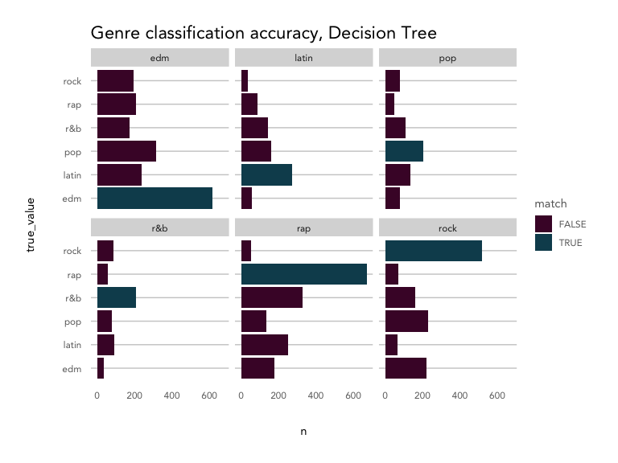
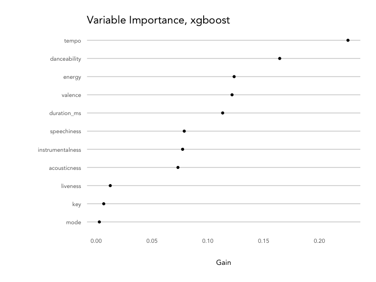
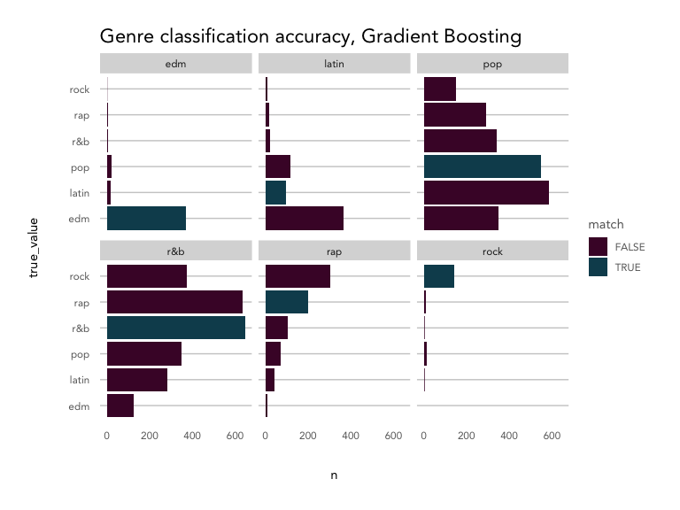

Spotify Audio Features + Music Genres
================

Classifying songs into major music genres Understanding the how
Spotify’s audio features map onto major music genres

## Exploring Spotify’s audio features

Spotify provies 12 [audio
features](https://developer.spotify.com/documentation/web-api/reference/object-model/#audio-features-object)
for each track, including confidence measures like `acousticness`,
`liveness`, `speechiness` and `instrumentalness`, perceptual measures
like `energy`, `loudness`, `danceability` and `valence` (positiveness),
and descriptors like `duration`, `tempo`, `key`, and `mode`.

It’s likely that Spotify uses these features to power their algorithms
for products like Spotify Radio and custom playlists like Discover
Weekly and Daily Mixes. Of course, those algorithms also make use of
Spotify’s vast listener data - your listening and playlist curation
history, as well as the data from users similar to you.

Typically, genre operates in a very subjective zone, where there are no
hard and fast rules for classifying a given track or artist as “hard
rock” vs. “folk rock,” but rather the listener knows it when they hear
it. Spotify has the benefit of letting humans create relationships
between songs and weigh in on genre via listening and creating
playlists. With just the quantitative features, is it possible to
classify songs into broad genres? And what can these audio features tell
us about the qualities of each genre?

We’ll look into a sample of songs from six broad genres - pop, rap,
rock, latin, EDM, and R\&B - to find out.

### Getting the data

Genres were selected from [Every
Noise](http://everynoise.com/everynoise1d.cgi?scope=all), a fascinating
visualization of the Spotify genre-space maintained by a genre
taxonomist. The top four sub-genres for each were used to query Spotify
for 20 playlists each, resulting in about 5000 songs for each genre,
split across a varied sub-genre space.

``` r
library(tidyverse)
library(formattable)
library(randomForest)
library(rpart)
library(rpart.plot)
library(xgboost)
source('../kp_themes/theme_kp.R')

knitr::opts_chunk$set(echo = TRUE, fig.width = 8, fig.height = 6, warning = FALSE, error = FALSE, message = FALSE)
```

### Exploring audio features by genre

``` r
# refer to spotify_dataset.R for how this dataset was generated
playlist_songs <- read.csv('genre_songs_expanded.csv', stringsAsFactors = FALSE) 

feature_names <- names(playlist_songs)[12:23]

playlist_songs %>%
  select(c('playlist_genre', feature_names)) %>%
  pivot_longer(cols = feature_names) %>%
  ggplot(aes(x = value)) +
  geom_density(aes(color = playlist_genre), alpha = 0.5) +
  facet_wrap(~name, ncol = 3, scales = 'free') +
  labs(title = 'Spotify Audio Feature Density - by Genre',
       x = '', y = 'density') +
  theme_kp() +
  theme(axis.text.y = element_blank()) + 
  scale_color_kp(palette = 'mixed')
```

<!-- -->

Overall, the songs in the dataset tend to have low acousticness,
liveness, instrumentalness and speechiness, with higher danceability,
energy, and loudness. Valence is evenly distributed.

Breaking things out by genre, EDM tracks are most likely to not be
acoustic and have high energy with low valence (sad or depressed); latin
tracks have high valence (are positive or cheerful) and danceability;
rap songs score highly for speechiness and danceability; and rock songs
are most likely to be recorded live and have low danceability.

Based on the density plot, it looks like energy, valence, and
danceability may provide the most separation between genres during
classification, while instrumentalness and key and key may not help
much.

How do these features correlate with one another? Are there any that may
be redundant?

``` r
playlist_songs %>%
  select(feature_names) %>%
  scale() %>%
  cor() %>%
  corrplot::corrplot(method = 'color', 
                     order = 'hclust', 
                     type = 'upper', 
                     diag = FALSE, 
                     tl.col = 'black',
                     addCoef.col = "grey30",
                     number.cex = 0.5,
                     col = colorRampPalette(colors = c(kp_cols('red'), 'white', kp_cols('dark_blue')))(200),
                     main = 'Audio Feature Correlation',
                     mar = c(2,2,2,2),
                     family = 'Avenir')
```

<!-- -->

Energy and loudness are fairly highly correlated (0.68). Let’s remove
loudness, since energy appears to give more distinction between genre
groups (as seen in the density plot).

Energy and acousticness are negatively correlated, which makes sense,
along with the positive correlation between danceability and valence
(happier songs lead to more dancing). Liveness, tempo, and energy are
clustered together, as are speechiness and danceability.

``` r
# remove loudness
feature_names_reduced <- names(playlist_songs)[c(12:14,16:23)]
```

How do the genres correlate with each other? How consistent are songs
within a given genre?

``` r
# take a random sample
set.seed(0012)
song_sample <- sample(1:nrow(playlist_songs), nrow(playlist_songs)*.05, replace = FALSE)

# create a key dataframe with ids/genres with numerical index
key <- playlist_songs %>%
  select(track.id, playlist_genre) %>%
  mutate(position = as.character(1:n()))

key <- key[song_sample, ]

# create a correlation matrix, then melt it
song_cor <- playlist_songs[song_sample, ] %>% 
  select(feature_names_reduced) %>%
  scale() %>%
  t() %>%
  cor() %>%
  as.data.frame() %>%
  mutate(index = row.names(.)) %>%
  pivot_longer(-index) %>%
  filter(!is.na(value) & index != name) %>%
  left_join(key, by = c('index' = 'position')) %>%
  left_join(key, by = c('name' = 'position')) 

# summarise by genres
genre_cor <- song_cor %>%
  group_by(playlist_genre.x, playlist_genre.y) %>%
  summarise(avg_cor = mean(value)) %>%
  ungroup() 

genre_cor_matrix <- genre_cor %>%
  pivot_wider(id_cols = 'playlist_genre.x', 
              names_from = 'playlist_genre.y', 
              values_from = 'avg_cor')

row.names(genre_cor_matrix) <- genre_cor_matrix$playlist_genre.x

genre_cor_matrix %>%
  select(-playlist_genre.x) %>%
  as.matrix() %>%
  corrplot::corrplot(method = 'color', 
                     order = 'hclust',
                     type = 'upper',
                     tl.col = 'black',
                     addCoef.col = "grey40",
                     number.cex = 0.75,
                     col = colorRampPalette(colors = c(kp_cols('red'), 'white', kp_cols('dark_blue')))(200),
                     mar = c(2,2,2,2),
                     main = '\nAverage Correlation Between Genre Songs',
                     family = 'Avenir'
                     )
```

<!-- -->

Songs within each genre vary quite a bit\! EDM and rock songs are the
most consistent, with a correlation strength of 0.12, while pop songs
are the least consistent at just 0.02.

R\&B and EDM (-0.08) and rap and rock(-0.08) have the strongest negative
correlations of any genre pairs.The rest of the genres don’t negatively
or positively correlate much with one another, which may make them hard
to classify.

## Classifying songs into genres using audio features

Our first question was *is it possible* to classify songs into genres
with just audio features; our secondary question is *what can these
audio features tell us* about the distinctions between genre. With that
aim, we should focus on classification models that are interpretable and
provide insight into which features were important in organizing a new
song into a given genre.

Classification algorithms that allow for greater interpretation of the
features include `decision trees`, `random forests`, and `gradient
boosting`.

### Preparing the data for training

First, we’ll scale the numeric features, and then split into a training
set (80% of the songs) and a test set (20%).

``` r
playlist_songs_scaled <- playlist_songs %>%
  mutate_if(is.numeric, scale)

set.seed(1234)
training_songs <- sample(1:nrow(playlist_songs_scaled), nrow(playlist_songs_scaled)*.80, replace = FALSE)
train_set <- playlist_songs_scaled[training_songs, c('playlist_genre', feature_names_reduced)] 
test_set <- playlist_songs_scaled[-training_songs, c('playlist_genre', feature_names_reduced)] 

train_resp <- playlist_songs_scaled[training_songs, 'playlist_genre']
test_resp <- playlist_songs_scaled[-training_songs, 'playlist_genre']
```

``` r
classification_plot <- function(compare_df, model_name){
  
  compare_df %>%
    count(true_value, predicted_value) %>%
    mutate(match = ifelse(true_value == predicted_value, TRUE, FALSE)) %>%
    ggplot(aes(x = true_value, y = n)) +
    geom_col(aes(fill = match), position = 'dodge') +
    facet_wrap(~predicted_value, ncol = 3) +
    coord_flip() + 
    labs(title = paste0('Genre classification accuracy, ', model_name)) +
    theme_kp() +
    scale_fill_kp()
  
  
}
```

### PCA ?

### Decision Tree

``` r
#https://medium.com/analytics-vidhya/a-guide-to-machine-learning-in-r-for-beginners-decision-trees-c24dfd490abb
model_dt <- rpart(playlist_genre ~ ., data = train_set)

rpart.plot(model_dt, 
           type = 5, 
           extra = 104,
           box.palette = list(purple = "#490B32",
               red = "#9A031E",
               orange = '#FB8B24',
               dark_blue = "#0F4C5C",
               blue = "#5DA9E9",
               grey = '#66717E'),
           leaf.round = 0,
           fallen.leaves = FALSE, 
           branch = 0.3, 
           under = TRUE,
           under.col = 'grey40',
           family = 'Avenir',
           main = 'Genre Decision Tree',
           tweak = 1.2)
```

<!-- -->

``` r
predict_dt <- predict(object = model_dt, newdata = test_set)
max_id <- apply(predict_dt, 1, which.max)
pred <- levels(as.factor(test_set$playlist_genre))[max_id]

compare_dt <- data.frame(true_value = test_set$playlist_genre,
                         predicted_value = pred,
                         model = 'decision_tree',
                         stringsAsFactors = FALSE)

# visualize
classification_plot(compare_dt, 'Decision Tree')
```

<!-- -->

### Random Forest

``` r
model_rf <- randomForest(as.factor(playlist_genre) ~ ., ntree = 100, importance = TRUE, data = train_set)

importance(model_rf, type = 1) %>%
  as.data.frame() %>%
  mutate(measure = row.names(.)) %>%
  ggplot(aes(x = reorder(measure, MeanDecreaseAccuracy), y = MeanDecreaseAccuracy)) +
  geom_point() +
  coord_flip() +
  theme_kp() +
  labs(title = 'Variable Importance, Random Forest',
       y = 'Mean Decrease in Accuracy', x = '')
```

<!-- -->

``` r
predict_rf <- predict(model_rf, test_set)

compare_rf <- data.frame(true_value = test_resp,
                         predicted_value = predict_rf,
                         model = 'random_forest',
                         stringsAsFactors = FALSE) 

# visualize
classification_plot(compare_rf, 'Random Forest')
```

<!-- -->

### Gradient Boosting

``` r
#https://www.hackerearth.com/practice/machine-learning/machine-learning-algorithms/beginners-tutorial-on-xgboost-parameter-tuning-r/tutorial/
matrix_train_gb <- xgb.DMatrix(data = as.matrix(train_set[,-1]), label = as.numeric(as.factor(train_set[,1])))
matrix_test_gb <- xgb.DMatrix(data = as.matrix(test_set[,-1]), label = as.numeric(as.factor(test_set[,1])))

model_gb <- xgboost(data = matrix_train_gb, 
                    nrounds = 25)
```

    ## [1]  train-rmse:2.606971 
    ## [2]  train-rmse:2.082558 
    ## [3]  train-rmse:1.757624 
    ## [4]  train-rmse:1.557356 
    ## [5]  train-rmse:1.446128 
    ## [6]  train-rmse:1.375646 
    ## [7]  train-rmse:1.335200 
    ## [8]  train-rmse:1.311780 
    ## [9]  train-rmse:1.297998 
    ## [10] train-rmse:1.284344 
    ## [11] train-rmse:1.275557 
    ## [12] train-rmse:1.263547 
    ## [13] train-rmse:1.259213 
    ## [14] train-rmse:1.254474 
    ## [15] train-rmse:1.249747 
    ## [16] train-rmse:1.247368 
    ## [17] train-rmse:1.241156 
    ## [18] train-rmse:1.238119 
    ## [19] train-rmse:1.235940 
    ## [20] train-rmse:1.231966 
    ## [21] train-rmse:1.230567 
    ## [22] train-rmse:1.226848 
    ## [23] train-rmse:1.220060 
    ## [24] train-rmse:1.215683 
    ## [25] train-rmse:1.208768

``` r
xgb.importance(model = model_gb) %>%
  ggplot(aes(x = reorder(Feature, Gain), y = Gain)) +
  geom_point() +
  coord_flip() +
  theme_kp() +
  labs(title = 'Variable Importance, xgboost',
       y = 'Gain', x = '')
```

<!-- -->

``` r
predict_gb <- predict(model_gb, matrix_test_gb)
predict_gb <- round(predict_gb)
predict_gb[predict_gb == 0] <- 1
predict_gb[predict_gb == 7] <- 6
predict_gb <- levels(as.factor(test_set$playlist_genre))[predict_gb]

compare_gb <- data.frame(true_value = test_resp,
                         predicted_value = predict_gb,
                         model = 'xgboost',
                         stringsAsFactors = FALSE) 

# visualize
classification_plot(compare_gb, 'Gradient Boosting')
```

<!-- -->

### Model Comparison

``` r
classification_test_results <- compare_rf %>%
  rbind(compare_dt) %>%
  rbind(compare_gb)

accuracy_results <- classification_test_results %>%
  mutate(match = ifelse(true_value == predicted_value, 1, 0)) %>%
  group_by(model) %>%
  summarise(accurate = sum(match),
            total = n()) %>%
  ungroup() %>%
  mutate(accuracy = accurate/total)

accuracy_results %>%
  mutate(accuracy = formattable::percent(accuracy,2)) %>%
  select(model, accuracy) %>%
  arrange(desc(accuracy)) %>%
  knitr::kable()
```

| model          | accuracy |
| :------------- | -------: |
| random\_forest |   53.72% |
| decision\_tree |   38.02% |
| xgboost        |   30.23% |

### Appendix

``` r
# run k nearest neighbors 
# at various values of k
# select_k <- NULL
# 
# for(i in 1:50){
#   result_knn <- class::knn(train = train_set[,-1], test = test_set[,-1], cl = train_resp, k = i)
# 
#   compare_knn <- data.frame(true_value = test_resp,
#                                 predicted_value = result_knn,
#                                 stringsAsFactors = FALSE) %>%
#     count(true_value, predicted_value) %>%
#     mutate(match = ifelse(true_value == predicted_value, TRUE, FALSE))
#   
#   accuracy_knn <- compare_knn %>%
#     group_by(match) %>%
#     summarise(n = sum(n)) %>%
#     ungroup() %>%
#     mutate(percent = n/sum(n),
#            k = i,
#            model = 'knn') %>%
#     filter(match == TRUE)
#     
#   select_k <- rbind(select_k, accuracy_knn)
#   
# }
# 
# select_k %>%
#   ggplot(aes(x = k, y = percent)) + 
#   geom_point() + 
#   geom_line() +
#   theme_kp() +
#   labs(title = 'Accuracy by Number of Neighbors',
#        x = 'Number of Neighbors (k)',
#        y = 'Percent of observations accurately classified')
# 
# # 29 is the best
# result_knn <- class::knn(train = train_set[,-1], test = test_set[,-1], cl = train_resp, k = 29)
# 
# # check
# compare_knn <- data.frame(true_value = test_resp,
#                           predicted_value = result_knn,
#                           model = 'knn',
#                           stringsAsFactors = FALSE)
# 
# # visualize
# classification_plot(compare_knn, 'KNN')
```
