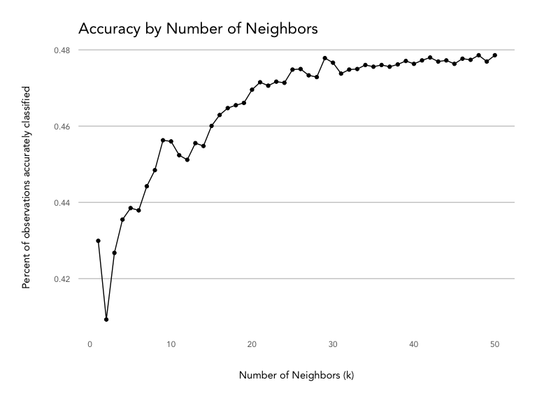
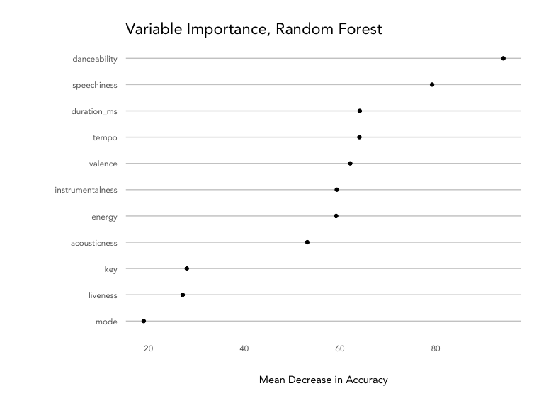
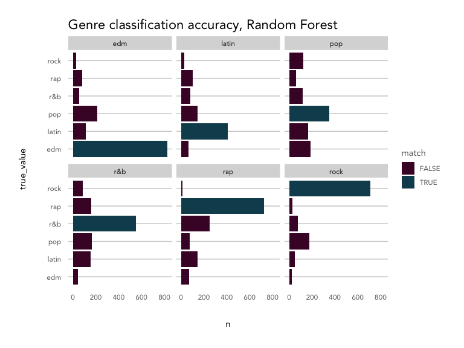

Spotify Audio Features + Music Genres
================

Classifying songs into major music genres Understanding the how
Spotify’s audio features map onto major music genres

Spotify provies 12 [audio
features](https://developer.spotify.com/documentation/web-api/reference/object-model/#audio-features-object)
for each track, including confidence measures like `acousticness`,
`liveness`, `speechiness` and `instrumentalness`, perceptual measures
like `energy`, `loudness`, `danceability` and `valuence` (positiveness),
and descriptors like `duration`, `tempo`, `key`, and `mode`.

``` r
library(tidyverse)
library(randomForest)
library(formattable)
source('../kp_themes/theme_kp.R')

knitr::opts_chunk$set(echo = TRUE, fig.width = 8, fig.height = 6)
```

``` r
# refer to spotify_dataset.R for how this dataset was generated
playlist_songs <- read.csv('genre_songs_expanded.csv', stringsAsFactors = FALSE) 

feature_names <- names(playlist_songs)[12:23]

playlist_songs %>%
  select(c('playlist_genre', feature_names)) %>%
  pivot_longer(cols = feature_names) %>%
  ggplot(aes(x = value)) +
  geom_density(aes(color = playlist_genre), alpha = 0.5) +
  facet_wrap(~name, ncol = 3, scales = 'free') +
  labs(title = 'Spotify Audio Feature Density - by Genre',
       x = '', y = 'density') +
  theme_kp() +
  theme(axis.text.y = element_blank()) + 
  scale_color_kp(palette = 'mixed')
```

<!-- -->

Overall, the songs in the dataset tend to have low acousticness,
liveness, instrumentalness and speechiness, with higher danceability,
energy, and loudness. Valence is evenly distributed.

Breaking things out by genre, EDM tracks are most likely to not be
acoustic and have high energy with low valence (sad or depressed); latin
tracks have high valence (are positive or cheerful) and danceability;
rap songs score highly for speechiness and danceability; and rock songs
are most likely to be recorded live and have low danceability.

Based on the density plot, it looks like energy, valence, and
danceability may provide the most separation between genres during
classification, while instrumentalness and key and key may not help
much.

How do these features correlate with one another? Are there any that are
redundant?

``` r
playlist_songs %>%
  select(feature_names) %>%
  scale() %>%
  cor() %>%
  corrplot::corrplot(method = 'color', 
                     order = 'hclust', 
                     type = 'upper', 
                     diag = FALSE, 
                     tl.col = 'black',
                     addCoef.col = "grey30",
                     number.cex = 0.5,
                     col = colorRampPalette(colors = c(kp_cols('red'), 'white', kp_cols('dark_blue')))(200),
                     main = 'Audio Feature Correlation',
                     mar = c(2,2,2,2),
                     family = 'Avenir')
```

<!-- -->

Energy and loudness are fairly highly correlated (0.68). Let’s remove
loudness, since energy appears to give more distinction between genre
groups (as seen in the density plot).

``` r
# remove loudness
feature_names_reduced <- names(playlist_songs)[c(12:14,16:23)]
```

How do the genres correlate with each other? How consistent are songs
within a given genre?

``` r
# take a random sample
set.seed(0012)
song_sample <- sample(1:nrow(playlist_songs), nrow(playlist_songs)*.05, replace = FALSE)

# create a key dataframe with ids/genres with numerical index
key <- playlist_songs %>%
  select(track.id, playlist_genre) %>%
  mutate(position = as.character(1:n()))

key <- key[song_sample, ]

# create a correlation matrix, then melt it
song_cor <- playlist_songs[song_sample, ] %>% 
  select(feature_names_reduced) %>%
  scale() %>%
  t() %>%
  cor() %>%
  as.data.frame() %>%
  mutate(index = row.names(.)) %>%
  pivot_longer(-index) %>%
  filter(!is.na(value) & index != name) %>%
  left_join(key, by = c('index' = 'position')) %>%
  left_join(key, by = c('name' = 'position')) 

# summarise by genres
genre_cor <- song_cor %>%
  group_by(playlist_genre.x, playlist_genre.y) %>%
  summarise(avg_cor = mean(value)) %>%
  ungroup() 

genre_cor_matrix <- genre_cor %>%
  pivot_wider(id_cols = 'playlist_genre.x', 
              names_from = 'playlist_genre.y', 
              values_from = 'avg_cor')

row.names(genre_cor_matrix) <- genre_cor_matrix$playlist_genre.x
```

    ## Warning: Setting row names on a tibble is deprecated.

``` r
genre_cor_matrix %>%
  select(-playlist_genre.x) %>%
  as.matrix() %>%
  corrplot::corrplot(method = 'color', 
                     order = 'hclust',
                     type = 'upper',
                     tl.col = 'black',
                     addCoef.col = "grey40",
                     number.cex = 0.75,
                     col = colorRampPalette(colors = c(kp_cols('red'), 'white', kp_cols('dark_blue')))(200),
                     mar = c(2,2,2,2),
                     main = '\nAverage Correlation Between Genre Songs',
                     family = 'Avenir'
                     )
```

<!-- -->

Songs within each genre vary quite a bit\! EDM and rock songs are the
most consistent, with a correlation strength of 0.12, while pop songs
are the least consistent at just 0.02.

R\&B and EDM (-0.08) and rap and rock(-0.08) have the strongest negative
correlations of any genre pairs.The rest of the genres don’t negatively
or positively correlate much with one another, which may make them hard
to classify.

### Preparing the data for training

``` r
set.seed(1234)
training_songs <- sample(1:nrow(playlist_songs), nrow(playlist_songs)*.80, replace = FALSE)
train_set <- playlist_songs[training_songs, c('playlist_genre', feature_names_reduced)] 
test_set <- playlist_songs[-training_songs, c('playlist_genre', feature_names_reduced)] 

train_resp <- playlist_songs[training_songs, 'playlist_genre']
test_resp <- playlist_songs[-training_songs, 'playlist_genre']
```

### K Nearest Neighbors

``` r
# run k nearest neighbors 
# at various values of k
select_k <- NULL

for(i in 1:10){
  kresult <- class::knn(train = train_set[,-1], test = test_set[,-1], cl = train_resp, k = i)

  compare_knn <- data.frame(true_value = test_resp,
                                predicted_value = kresult,
                                stringsAsFactors = FALSE) %>%
    count(true_value, predicted_value) %>%
    mutate(match = ifelse(true_value == predicted_value, TRUE, FALSE))
  
  accuracy_knn <- compare_knn %>%
    group_by(match) %>%
    summarise(n = sum(n)) %>%
    ungroup() %>%
    mutate(percent = n/sum(n),
           k = i,
           model = 'knn') %>%
    filter(match == TRUE)
    
  select_k <- rbind(select_k, accuracy_knn)
  
}

# 1 is the best
kresult <- class::knn(train = train_set[,-1], test = test_set[,-1], cl = train_resp, k = 1)

# check
compare_knn <- data.frame(true_value = test_resp,
                              predicted_value = kresult,
                              stringsAsFactors = FALSE) %>%
  count(true_value, predicted_value) %>%
  mutate(match = ifelse(true_value == predicted_value, TRUE, FALSE))

accuracy_knn <- compare_knn %>%
  group_by(match) %>%
  summarise(n = sum(n)) %>%
  ungroup() %>%
  mutate(percent = n/sum(n),
         model = 'knn') %>%
  filter(match == TRUE)

# visualize
compare_knn %>%
  ggplot(aes(x = true_value, y = n)) +
  geom_col(aes(fill = match), position = 'dodge') +
  facet_wrap(~predicted_value, ncol = 3) +
  coord_flip() + 
  labs(title = 'Genre classification accuracy, KNN') +
  theme_kp() +
  scale_fill_kp()
```

<!-- -->

### Random Forest

``` r
rfresult <- randomForest(as.factor(playlist_genre) ~ ., ntree = 100, importance = TRUE, data = train_set)

importance(rfresult, type = 1) %>%
  as.data.frame() %>%
  mutate(measure = row.names(.)) %>%
  ggplot(aes(x = reorder(measure, MeanDecreaseAccuracy), y = MeanDecreaseAccuracy)) +
  geom_point() +
  coord_flip() +
  theme_kp() +
  labs(title = 'Random Forest Variable Importance',
       y = 'Mean Decrease in Accuracy', x = '')
```

<!-- -->

``` r
predict_rf <- predict(rfresult, test_set)

compare_rf <- test_set %>%
  cbind(predict_rf) %>%
  count(playlist_genre, predict_rf) %>%
  mutate(match = ifelse(playlist_genre == predict_rf, TRUE, FALSE))

accuracy_rf <- compare_rf %>%
  group_by(match) %>%
  summarise(n = sum(n)) %>%
  ungroup() %>%
  mutate(percent = n/sum(n),
         model = 'random forest') %>%
  filter(match == TRUE)

compare_rf %>%
  ggplot(aes(x = playlist_genre, y = n)) +
  geom_col(aes(fill = match), position = 'dodge') +
  facet_wrap(~predict_rf, ncol = 3) +
  coord_flip() + 
  labs(title = 'Genre classification accuracy, Random Forest') +
  theme_kp() +
  scale_fill_kp()
```

<!-- -->

### Model Comparison

``` r
accuracy_knn %>%
  rbind(accuracy_rf) %>%
  mutate(accuracy = percent(percent,2)) %>%
  select(model, accuracy) %>%
  knitr::kable()
```

| model         | accuracy |
| :------------ | -------: |
| knn           |   30.61% |
| random forest |   53.53% |

## Subgenres

Can we predict subgenres within a parent genre? How accurate would we be
if we predicted the parent genre, then moved onto a model to predict the
sub?
